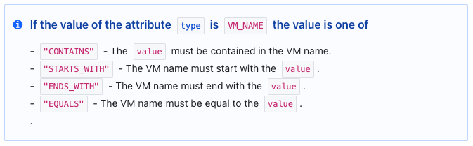

# `OneOfWithDescription`

!!! quote inline end "Released in v1.9.0"

This validator allows to check if the string is one of the values ​​of another attribute.
It also allows to format the description and markdown description accordingly

## How to use it

```go
// Schema defines the schema for the resource.
func (r *xResource) Schema(ctx context.Context, _ resource.SchemaRequest, resp *resource.SchemaResponse) {
    resp.Schema = schema.Schema{
        (...)
            "foo": schema.StringAttribute{
                Optional:            true,
                MarkdownDescription: "foo ...",
                Validators: []validator.String{
                    fstringvalidator.OneOf("VM_NAME", "VM_TAGS"),
                },
            },
            "bar": schema.StringAttribute{
                Optional:            true,
                MarkdownDescription: "bar of ...",
                Validators: []validator.String{
                    fstringvalidator.OneOfWithDescriptionIfAttributeIsOneOf(
                        path.MatchRelative().AtParent().AtName("foo"),
                        []attr.Value{types.StringValue("VM_NAME")},
                        func() []fstringvalidator.OneOfWithDescriptionIfAttributeIsOneOfValues {
                            return []fstringvalidator.OneOfWithDescriptionIfAttributeIsOneOfValues{
                                {
                                    Value:       "CONTAINS",
                                    Description: "The `value` must be contained in the VM name.",
                                },
                                {
                                    Value:       "STARTS_WITH",
                                    Description: "The VM name must start with the `value`.",
                                },
                                {
                                    Value:       "ENDS_WITH",
                                    Description: "The VM name must end with the `value`.",
                                },
                                {
                                    Value:       "EQUALS",
                                    Description: "The VM name must be equal to the `value`.",
                                },
                            }
                        }()...),
                },
            },
```

## Description and Markdown description

* **Description:**
If the value of attribute <.type is "VM_NAME" the allowed values are : "CONTAINS" (The `value` must be contained in the VM name.), "STARTS_WITH" (The VM name must start with the `value`.), "ENDS_WITH" (The VM name must end with the `value`.), "EQUALS" (The VM name must be equal to the `value`.)
* **Markdown description:**


